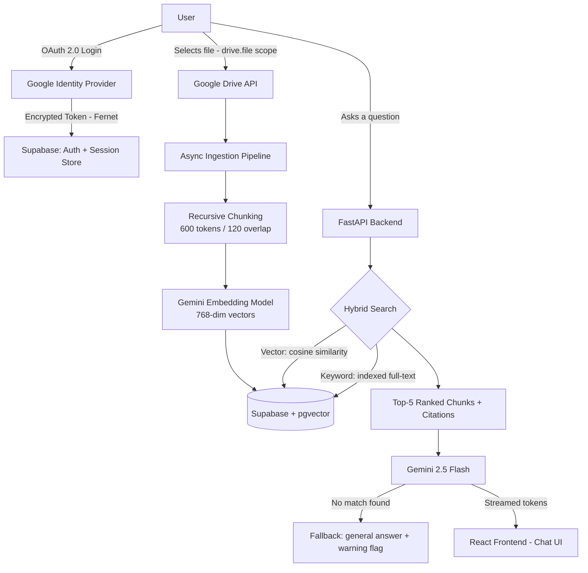

<div align="center">

# 🎓 TarkaSmart
### AI-Driven Academic Knowledge Engine — RAG-Powered, Cloud-Native, Privacy-First

*(formerly Student OS)*

[](https://react.dev/)
[](https://fastapi.tiangolo.com/)
[](https://supabase.com/)
[](https://www.langchain.com/)
[](https://ai.google.dev/)
[](#-license)

**[🔗 Live Demo](https://tarkasmart.vercel.app)** · **[📖 Technical Deep-Dive](./technical_documentation.md)** ·

</div>

---

## 📌 Overview

**TarkaSmart** is a production-grade, AI-native academic workspace that turns scattered course material into a searchable, conversational knowledge base. It connects directly to a user's Google Drive, ingests documents through an asynchronous **Retrieval-Augmented Generation (RAG)** pipeline, and answers questions using a **hybrid semantic + keyword search engine** — grounded strictly in the user's own uploaded content, with inline citations back to source file and page number.

Built with a **privacy-by-design** philosophy: TarkaSmart never has blanket access to a user's Drive. It only ever sees the exact files a user explicitly stages, via Google's restricted `drive.file` OAuth scope.

> 💡 **Why it matters:** Most "AI notes" tools either hallucinate answers or require full Drive access. TarkaSmart solves both — grounded answers with citations, and access scoped to only what the user shares.

---

## 🚀 Key Features

| Feature | Description |
|---|---|
| 🔍 **Hybrid RAG Pipeline** | Combines cosine-similarity vector search with full-text keyword search to close the semantic gap and boost retrieval precision beyond vector-only systems. |
| 🔐 **Scoped Google Integration** | OAuth 2.0 with `drive.file` scope — the app can only ever touch files the user explicitly selects. Zero blanket Drive access. |
| 🧩 **Smart Chunking** | Recursive sentence-aware splitting (600 tokens, 120 overlap) preserves semantic continuity across chunk boundaries instead of cutting ideas mid-thought. |
| 📎 **Cited, Grounded Answers** | Every answer returns the top-5 relevant chunks with source file name + page number — no black-box answers. |
| ⚡ **Real-Time Streaming** | Token-level response streaming to cut perceived latency on long answers. |
| 🛡️ **Graceful Fallback** | If no relevant chunks are found, the system falls back to general model reasoning *and explicitly flags* that the answer isn't grounded in user data — no silent hallucination. |
| 📊 **Evaluated, Not Assumed** | Faithfulness and answer relevancy are measured with the **RAGAS** framework, not eyeballed — scoring **0.98 faithfulness** and **perfect (1.00) context precision/recall**. See [full results](./TECHNICAL_DOCUMENTATION.md#8-rag-evaluation). |
| 🧱 **Encrypted Credential Handling** | All tokens and session data encrypted at rest using `cryptography.fernet` symmetric encryption. |
| 🖥️ **Dynamic Workspace UI** | Custom drag-resizable canvas layout — toggle between PDF viewer, Drive folder browser, and AI chat panel in one workspace. |
| ✅ **Built-in Task Engine** | Reactive, state-managed study task tracker embedded directly alongside the research material it relates to. |

---

## 🏗️ System Architecture



---

## 🛠 Technical Stack

**Frontend**
- React + Vite
- CSS-in-JS dynamic layout engine (custom drag-resize canvas)

**Backend**
- Python · FastAPI · Uvicorn (async request handling)

**AI / Orchestration**
- LangChain
- Google Gemini 1.5 Flash (generation)
- Gemini embedding model, 768-dimensional vectors

**Data Layer**
- Supabase (PostgreSQL + `pgvector` extension)
- Indexed hybrid search: vector (cosine similarity) + keyword (full-text)

**Security**
- Google OAuth 2.0, `drive.file` restricted scope
- `cryptography.fernet` symmetric encryption for credentials & sessions

**Evaluation**
- RAGAS framework — faithfulness & answer-relevancy scoring

**Deployment**
- Frontend: Vercel · Backend: Render / Railway

---

## 📊 Performance & Reliability

TarkaSmart follows a **"cloud-aware" engineering philosophy**: rather than over-provisioning for local hardware, bottlenecks identified during development (heavy local embedding models, GPU-bound evaluation) were solved by migrating specific workloads to cloud-native environments — see the [full write-up](./TECHNICAL_DOCUMENTATION.md) for the reasoning and trade-offs.

- ✅ Structured **RAGAS** evaluation pipeline to mathematically validate response quality (not just spot-checked)
- ✅ Exponential-backoff retry logic for rate-limited (HTTP 429) API calls
- ✅ Sequential processing safeguards to keep the pipeline stable under load
- ✅ Token-streamed responses to minimize perceived latency

**Measured RAG quality (RAGAS):**

| Metric | Score |
|---|---|
| Faithfulness | 0.9778 |
| Context Precision | 1.0000 |
| Context Recall | 1.0000 |
| Answer Relevancy | 0.9512 |

---

## 🔒 Security Principles

- **Scoped access, not blanket access** — TarkaSmart only ever operates on files the user explicitly authorizes via `drive.file`; personal folders stay untouched.
- **Data isolation** — user data is isolated via OAuth-based identity mapping in Supabase.
- **Encrypted secrets** — session data and credentials are Fernet-encrypted; no plaintext secrets ever touch the codebase or logs.

---

## 📁 Project Structure

```
student-os/
├── frontend/              # React + Vite client
├── backend/               # FastAPI application
│   ├── __init__.py
│   ├── student_backend.py
│   └── requirements.txt
├── supabase/  
│    └── mitigations/        # Supabase schema + pgvector setup (SQL migrations)
│        └──00000000000000_init_schema.sql   
├── eval/
│   ├── dataset_generator.py  
│   ├── eval_dataset.json    # output of dataset_generator.py 
│   └── RAGEvaluation.ipynb
├── README.md
└──  technical_documentation.md

```

---

## 💡 Getting Started

### 1. Clone the repository
```bash
git clone https://github.com/gargi-birwatkar/student-os.git
cd student-os
```

### 2. Database setup (Supabase)
Schema and `pgvector` setup live in the `migrations/` folder. After creating your Supabase project, run these against your database (via the Supabase SQL Editor or the Supabase CLI):

```bash
# Using Supabase CLI
supabase link --project-ref your-project-ref
supabase db push
```

This provisions the required tables, indexes, and the `pgvector` extension used for embedding storage and hybrid search.

### 3. Backend setup
```bash
python -m venv venv
source venv/bin/activate      # Windows: venv\Scripts\activate
pip install -r requirements.txt
```

Generate an encryption key:
```bash
python -c "from cryptography.fernet import Fernet; print(Fernet.generate_key().decode())"
```

Create a `.env` file in the backend root:
```env
SUPABASE_URL=your_supabase_url
SUPABASE_KEY=your_supabase_anon_key
GOOGLE_CLIENT_ID=your_client_id
GOOGLE_CLIENT_SECRET=your_client_secret
GEMINI_API_KEY=your_gemini_api_key
ENCRYPTION_SECRET_KEY=your_generated_fernet_key
```

Run the backend:
```bash
uvicorn main:app --reload
```

### 4. Frontend setup
```bash
cd frontend
npm install
```

2. **Development Start**:
```bash
   npm run dev
```

---

## 📈 Roadmap

- [ ] **Batch processing** — Celery-based task queues for concurrent multi-document indexing
- [ ] **Vector search caching** — reduce latency on repeated semantic queries
- [ ] **Multi-model support** — pluggable AI service layer to swap reasoning engines
- [ ] **Higher-dimensional embeddings** — scale beyond 768-dim as usage grows

---

## 🎥 Demo & Documentation
- 🔗 **Live Demo:** [TARKA SMART ](https://tarkasmart.vercel.app)
- 📖 **Engineering Deep-Dive:** [TECHNICAL_DOCUMENTATION.md](./technical_documentation.md) — build decisions, trade-offs, and how real production issues (rate limits, model swaps, evaluation bottlenecks) were solved
- 🎬 **Demo Video:** *[Insert Link Here]*
---

## 👩‍💻 Author

**Gargi Birwatkar**
Built solo — architecture, backend, frontend, evaluation, and deployment.

---

## 📄 License

Distributed under the MIT License.
